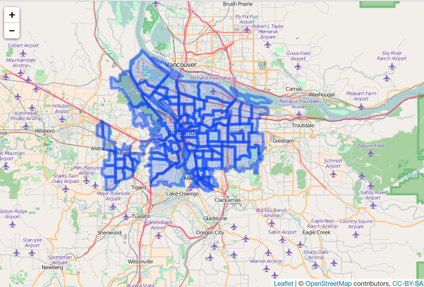

geofilter
=========

```{r echo=FALSE}
library("knitr")
hook_output <- knitr::knit_hooks$get("output")
knitr::knit_hooks$set(output = function(x, options) {
   lines <- options$output.lines
   if (is.null(lines)) {
     return(hook_output(x, options))  # pass to default hook
   }
   x <- unlist(strsplit(x, "\n"))
   more <- "..."
   if (length(lines)==1) {        # first n lines
     if (length(x) > lines) {
       # truncate the output, but add ....
       x <- c(head(x, lines), more)
     }
   } else {
     x <- c(if (abs(lines[1])>1) more else NULL,
            x[lines],
            if (length(x)>lines[abs(length(lines))]) more else NULL
           )
   }
   # paste these lines together
   x <- paste(c(x, ""), collapse = "\n")
   hook_output(x, options)
 })

knitr::opts_chunk$set(
  comment = "#>",
  collapse = TRUE,
  warning = FALSE,
  message = FALSE
)
```


`geofilter` does filtering on GeoJSON

Filtering is done with [jqr][jqr], an R client for the C library [jq][jq]. We 
could just parse to R objects with `jsonlite` then operate on lists or conver 
to other classes, but `jq` allows us to slice and dice/search/etc. geojson 
(which is just json really) without having to parse the entire json string 
(which is increasingly important as your input GeoJSON gets bigger).

This used to be within the [geoops][geoops] package, but was broken out here.

## Installation

```{r eval=FALSE}
devtools::install_github("ropenscilabs/geofilter")
```

```{r}
library("geofilter")
```

## filter geojson

```{r}
x <- "{\"type\":\"FeatureCollection\",\"features\":[{\"type\":\"Feature\",\"geometry\":{\"type\":\"Point\",\"coordinates\":[-99.74,32.45]},\"properties\":{}}]}"
x <- as.geojson(x)
sift_client(x, ".features[].geometry[]")
```

## sifting with jq

Using Zillow data, plot all data

```{r}
library("leaflet")
file <- system.file("examples", "zillow_or.geojson", package = "geofilter")
dat <- jsonlite::fromJSON(file, FALSE)
```

```{r eval=FALSE}
library("leaflet")
leaflet() %>%
  addTiles() %>%
  addGeoJSON(dat) %>%
  setView(-122.8, 44.8, zoom = 8)
```


Filter to features in Multnomah County only

```{r}
json <- paste0(readLines(file), collapse = "")
res <- sifter(json, COUNTY == Multnomah)
```

Check that only Multnomah County came back

```{r output.lines=1:10}
res %>%
  jqr::index() %>%
  jqr::dotstr(properties.COUNTY)
```

Plot it

```{r eval=FALSE}
leaflet() %>%
  addTiles() %>%
  addGeoJSON(res) %>%
  setView(-122.6, 45.5, zoom = 10)
```



## Meta

* Please [report any issues or bugs](https://github.com/ropenscilabs/geofilter/issues).
* License: MIT

[geojsonspec]: http://geojson.org/geojson-spec.html
[jqr]: https://github.com/ropensci/jqr
[jqr]: https://github.com/ropenscilabs/geoops
[jq]: https://github.com/stedolan/jq
