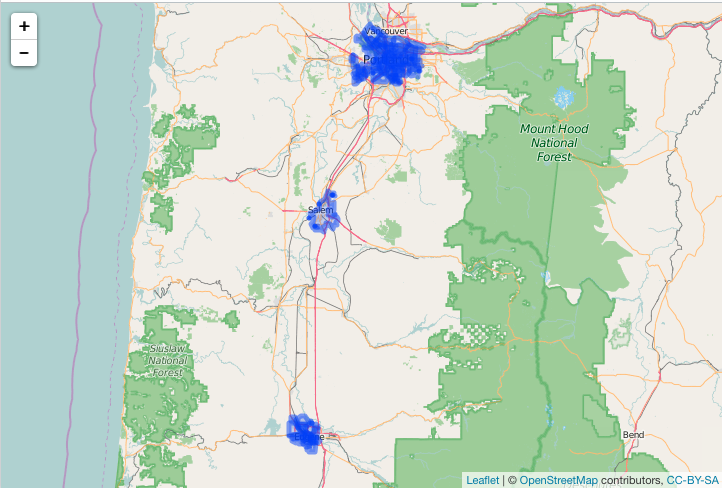

geofilter
=========


`geofilter` does filtering on GeoJSON

Filtering is done with [jqr][jqr], an R client for the C library [jq][jq]. We could just parse to R objects with `jsonlite` then operate on lists or conver to other classes, but `jq` allows us to slice and dice/search/etc. geojson (which is just json really) without having to parse the entire json string (which is increasingly important as your input GeoJSON gets bigger).

## Installation


```r
devtools::install_github("ropenscilabs/geofilter")
```


```r
library("geofilter")
```

## filter geojson


```r
x <- "{\"type\":\"FeatureCollection\",\"features\":[{\"type\":\"Feature\",\"geometry\":{\"type\":\"Point\",\"coordinates\":[-99.74,32.45]},\"properties\":{}}]}"
x <- as.geojson(x)
#> Error in eval(expr, envir, enclos): could not find function "as.geojson"
sift_client(x, ".features[].geometry[]")
#> [1] "[\"Point\", [-99.74,32.45]]"
```

## sifting with jq

Using Zillow data, plot all data


```r
library("leaflet")
file <- system.file("examples", "zillow_or.geojson", package = "geofilter")
dat <- jsonlite::fromJSON(file, FALSE)
```


```r
library("leaflet")
leaflet() %>%
  addTiles() %>%
  addGeoJSON(dat) %>%
  setView(-122.8, 44.8, zoom = 8)
```



Filter to features in Multnomah County only


```r
json <- paste0(readLines(file), collapse = "")
res <- sifter(json, COUNTY == Multnomah)
```

Check that only Multnomah County came back


```r
res %>%
  jqr::index() %>%
  jqr::dotstr(properties.COUNTY)
#> [
#>     "Multnomah",
#>     "Multnomah",
#>     "Multnomah",
#>     "Multnomah",
#>     "Multnomah",
#>     "Multnomah",
#>     "Multnomah",
#>     "Multnomah",
#>     "Multnomah",
...
```

Plot it


```r
leaflet() %>%
  addTiles() %>%
  addGeoJSON(res) %>%
  setView(-122.6, 45.5, zoom = 10)
```


## Meta

* Please [report any issues or bugs](https://github.com/ropenscilabs/geofilter/issues).
* License: MIT

[geojsonspec]: http://geojson.org/geojson-spec.html
[jqr]: https://github.com/ropensci/jqr
[jq]: https://github.com/stedolan/jq
